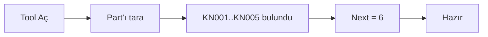
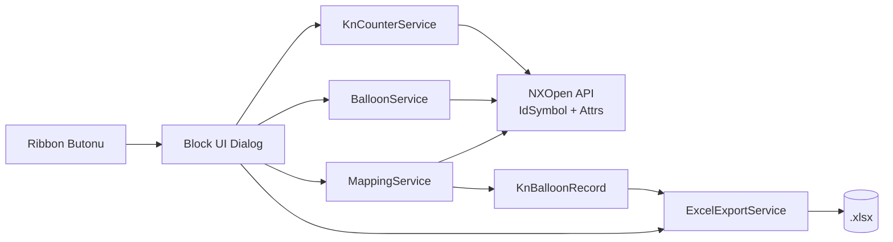
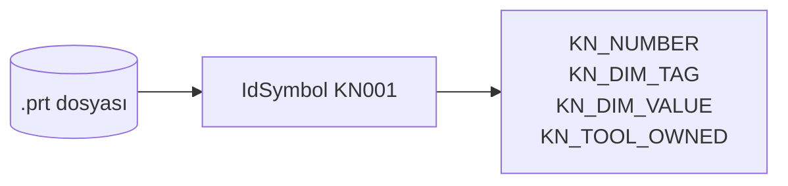
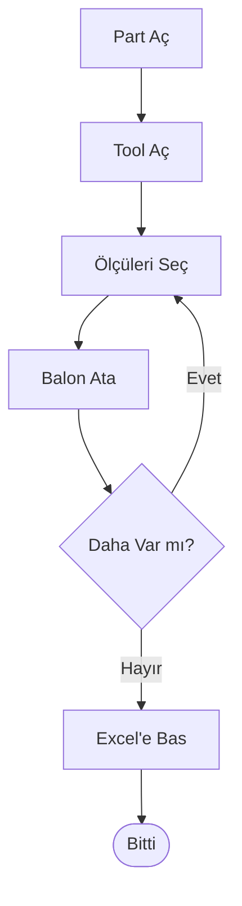

# KN Balloon Tool — Sunum

> Marp / Slidev / VS Code Markdown Preview ile slide-by-slide sunabilirsiniz.
> Her `---` yeni bir slide. Düz markdown olarak da okunabilir.

---

# KN Balon Atama & Excel İhraç

**NX 2406 için tek tıkla balonlama**

Demo · v1.0

---

## Problem

- Drafting / PMI ölçülerine **manuel** balon atmak zaman alıyor
- Balon numaralarını **akılda tutmak / sıralı yazmak** zor
- KN listesi Excel'e **elle** yazılıyor → hatalar, eksiklikler
- Ölçü revize olunca Excel **eskiyor**
- Aradan zaman geçince "kaldığı yerden devam" konusunda kopukluk

---

## Çözüm: KN Balloon Tool

Tek dialog, üç fonksiyon:

1. **Balon Ata** — Ölçüleri seç, otomatik artan `KN###` balon
2. **Manuel Eşleştir** — Elle çizilmiş balonları ölçülere bağla
3. **Excel'e Bas** — Tüm KN listesini güncel değerlerle XLSX'e ihraç

---

## Nasıl Görünür?

```
┌──────────────────────────────┐
│  KN Balon Atama              │
├──────────────────────────────┤
│  ◉ Balon Ata                 │
│    [ Ölçü seç ]  KN: [ 6 ]   │
│    [ Balon Ata ]             │
├──────────────────────────────┤
│  ◉ Manuel Eşleştir           │
│    [ Balon ] + [ Ölçü ]      │
│    [ Eşleştir ]              │
├──────────────────────────────┤
│  ◉ Excel İhraç               │
│    Yol: [ ...xlsx ]          │
│    [ Excel'e Bas ]           │
└──────────────────────────────┘
```

Ribbon'da **Balonlama → KN Balon Tool…** menüsünden açılır.

---

## Demo: 3 Adımda Balonlama

**1.** Drawing'i aç → Tool'u aç → Dialog `KN No = 1` ile gelir

**2.** Grafik ekranda 3 ölçü seç → **Balon Ata**

**3.** Sonuç: ölçülere leader ile bağlı **KN001, KN002, KN003** balonları

→ Sayaç 4'e atlar, hemen sonraki batch için hazır.

---

## Süper Güç #1 — "Kaldığı Yerden Devam"

- Bir hafta önce attınız: `KN001..KN005`
- Bugün part'ı açtınız, 2 yeni ölçü eklediniz
- Tool'u açtığınızda: **KN No otomatik 6**



**Hafıza gerekmez, NX part'ının kendisi hatırlar.**

---

## Süper Güç #2 — Anlık Değer Modu

Excel'i bastığınızda:

| KN No | **Anlık Değer** | Snapshot |
|---|---|---|
| KN001 | **12** | 10 |

→ Balon atıldığında değer **10** idi, sonra **12** yapıldı.
→ Aradaki fark sizi uyarır: bu ölçü revize edilmiş.

Üstelik **silinmiş** ölçüleri de yakalar: Snapshot dolu, Anlık boş, Not = "ÖLÇÜ BULUNAMADI".

---

## Süper Güç #3 — Manuel Balon Desteği

Stajyerin elle attığı `KN042` balonu var mı? Sorun değil.

1. Sayaç onu otomatik fark eder (sıradaki = 43)
2. **Manuel Eşleştir** ile ölçüye bağlarsın
3. Excel'de "Manuel eşleştirildi" notuyla çıkar

→ Tool, kendi yaptığı balonlar ile manuel olanları **eşit görür**.

---

## Mimari — Yüksek Seviye



**5 küçük servis. Hepsi state'siz. Tek state kaynağı: NX part.**

---

## Mimari — Persistence



- Tool'un hafızası YOK
- Tüm bilgi NX'in kendi annotation + user attribute mekanizmasında
- Part'ı taşı, ver, paylaş → bilgi part'la birlikte gelir

---

## Teknoloji

| Katman | Seçim |
|---|---|
| Dil | C# (.NET Framework 4.7.2) |
| NX entegrasyon | NXOpen .NET API |
| UI | Block UI Styler (`.dlx`) |
| Excel | ClosedXML (MIT, NuGet) |
| Dağıtım | `%UGII_USER_DIR%\startup\` |

**Tek bir DLL + bir `.dlx` + bir `.men`.** Kurulum 30 saniye.

---

## Tipik Kullanım Akışı



5 dakikalık manuel iş → **30 saniye**.

---

## Kazanımlar

- ✅ Tutarlı, ardışık KN numaraları
- ✅ İnsan hatasız Excel çıktısı
- ✅ Revizyon takibi (Anlık vs Snapshot)
- ✅ Manuel/otomatik balonlar bir arada
- ✅ Sıfır eğitim ihtiyacı — tek butonlu dialog
- ✅ Part'la birlikte taşınabilir state

---

## Yol Haritası (Sonraki Iterasyon)

- 🚀 Gerçek **Ribbon Tab** (şu an Menubar cascade)
- 🚀 KN boşluk tespiti (silinen numaraları gösterme)
- 🚀 Çoklu part / assembly desteği
- 🚀 Excel şablonu özelleştirme (logo, başlık)
- 🚀 Toplu re-numaralama (KN003'ü sil → tümünü kaydır)

---

## Soru-Cevap

**S: Tool kapanırken bir şey kaydetmem gerekir mi?**
H: Hayır. Part'ı normal kaydedersiniz, hepsi orada.

**S: NX 2406'dan eskisinde çalışır mı?**
H: NXOpen API'leri sürüm-bağımlı; eski sürümlere port gerekir.

**S: Aynı anda iki kişi balonlayabilir mi?**
H: NX zaten aynı parta iki kullanıcı izin vermez; sıralı çalışılır.

**S: Excel'i ne kadar sık basabilirim?**
H: İstediğiniz kadar — her seferinde **canlı** üretilir.

---

## Teşekkürler

**Sorular?**

- Kullanım Kılavuzu: `docs/UserGuide.md`
- UML Sınıf Diyagramı: `docs/UML.md`
- Use Case + Sequence: `docs/UseCase.md`
- Repo: `<branch URL>`
