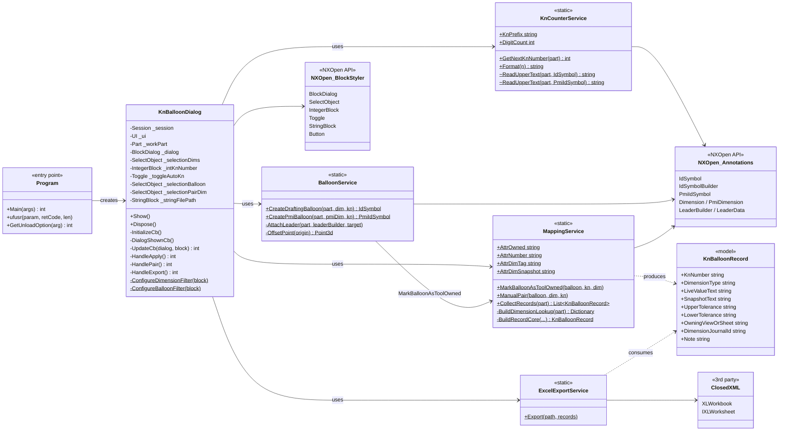
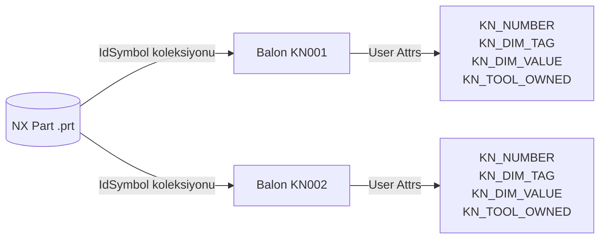

# UML — Sınıf Diyagramı

KN Balloon Tool'un yazılım mimarisi. Mermaid (GitHub render eder).



## Katmanlar

| Katman | Sorumluluk | Dosya |
|---|---|---|
| **Entry** | NX'in DLL'i yüklediği giriş noktası | `Program.cs` |
| **UI** | Block UI Styler dialog + olay kanalları | `Dialog/KnBalloonDialog.cs` + `.dlx` |
| **Service** | İş kuralları (sayaç, balon, mapping, excel) | `Services/*.cs` |
| **Model** | Salt veri taşıyıcısı | `Models/KnBalloonRecord.cs` |
| **API** | NXOpen .NET + ClosedXML | external |

## Bağımlılık Yönü

```
Program → Dialog → Services → (NXOpen + Models + ClosedXML)
```

Tek yönlü, üst katmanlar aşağıyı bilir, tersi yok. Servisler birbirini çağırırken yalnızca **BalloonService → MappingService** kenarı var (attribute setlemek için).

## Statik vs Instance

- **Instance:** Sadece `KnBalloonDialog` (dialog state'i tutuyor).
- **Static:** Tüm servisler. State tutmuyorlar; her çağrıda part'tan oku, işle, döndür. Bu mimari kararla "tool kapansa da bozulmasın" gereksinimi karşılandı — RAM state'i yok, kaynak NX part'ı.

## Persistence (Class diagram'ın dışında ama önemli)



Tüm KN ↔ ölçü bağı NX'in kendi annotation + attribute mekanizmasında yaşıyor. Tool tarafında ek bir veritabanı / dosya yok.
