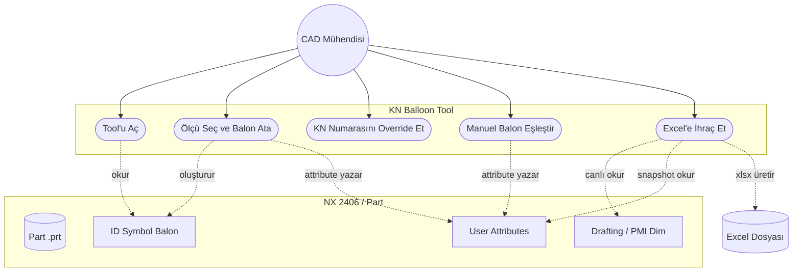
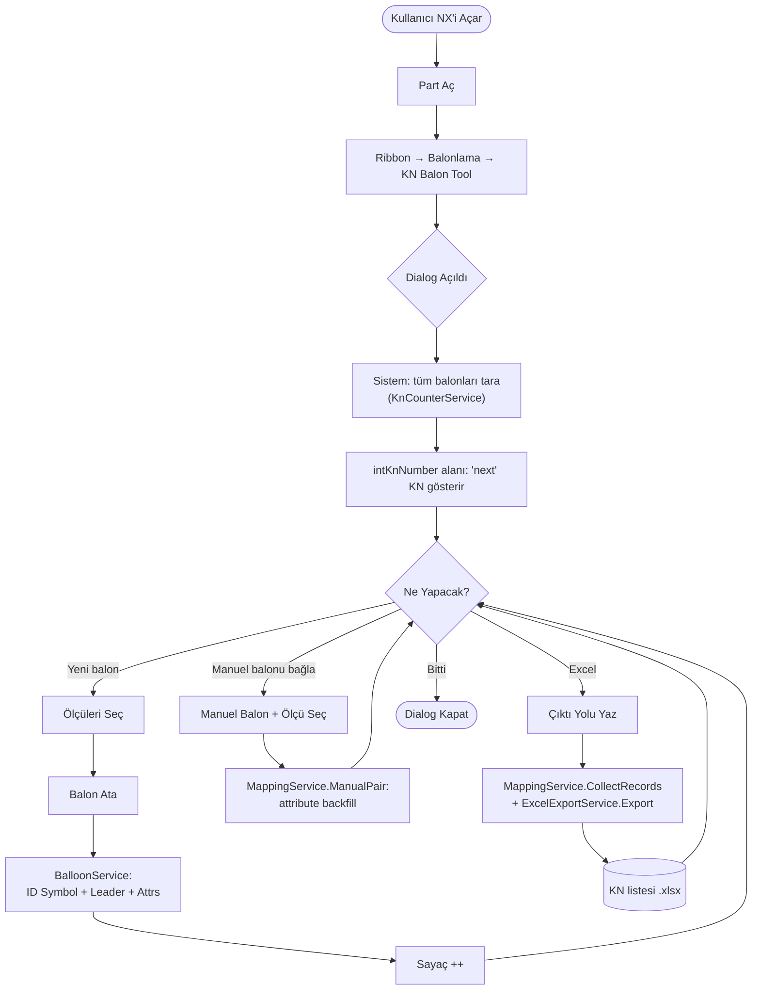
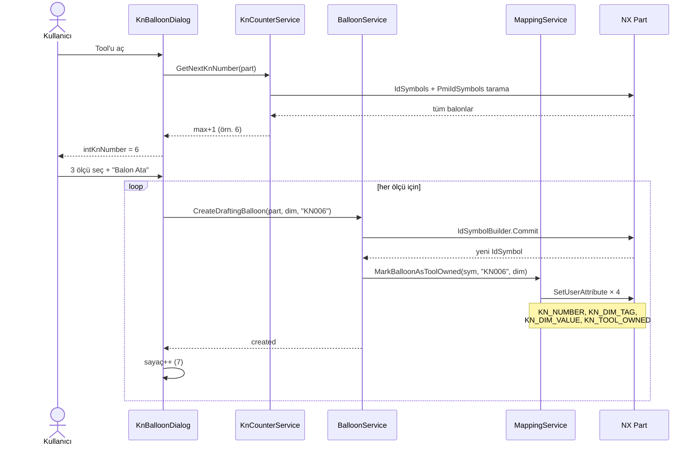
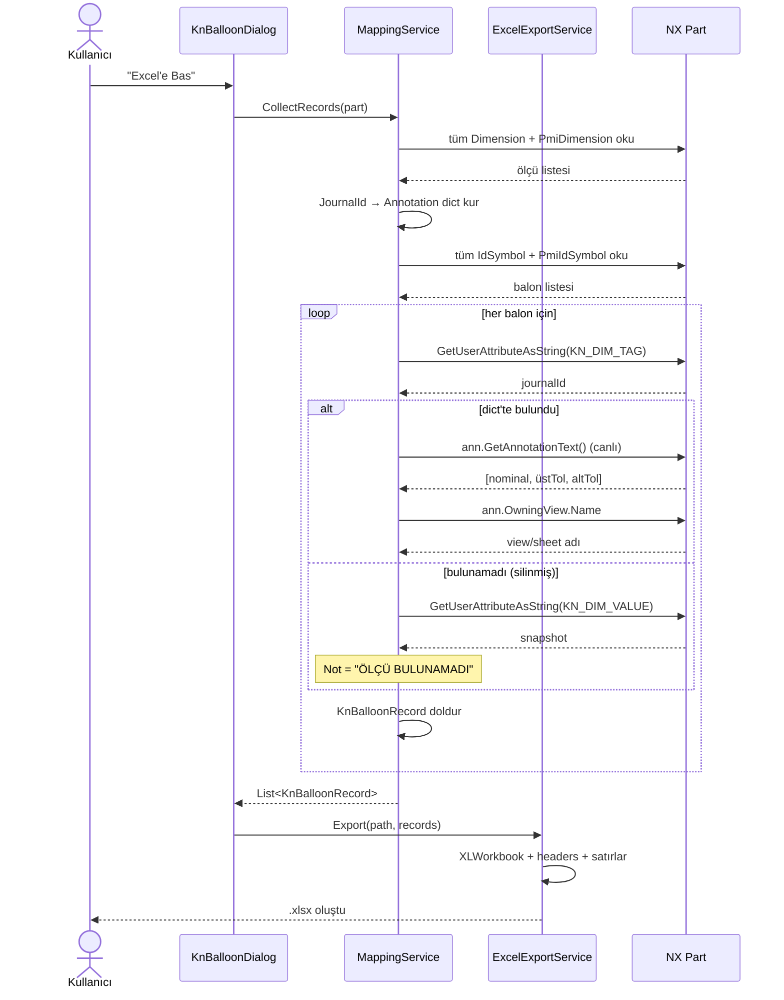
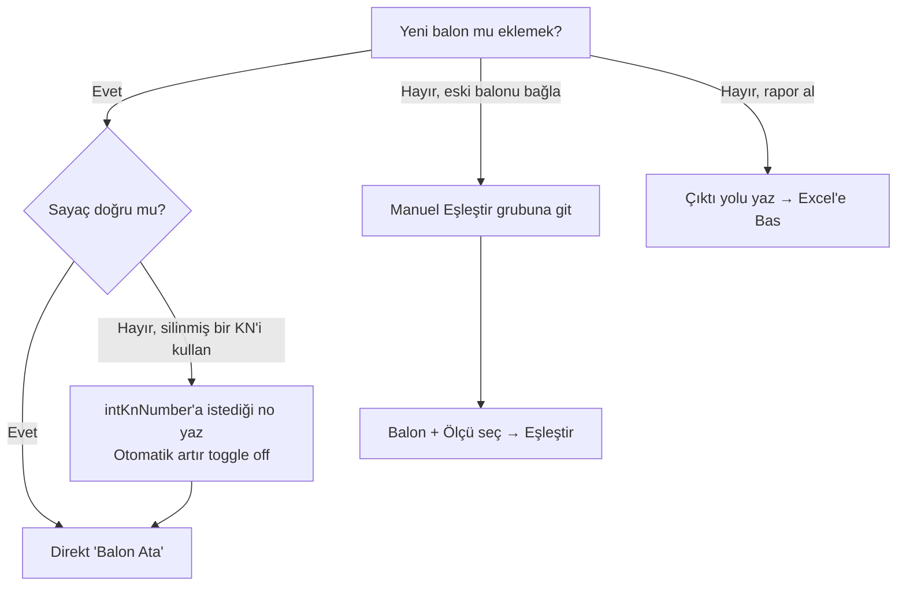

# Kullanıcı Diyagramları

## 1. Use Case Diyagramı

Aktör ve sistem etkileşimleri.

## 2. Ana Kullanım Akışı (User Flow)

## 3. Sıra Diyagramı: Balon Atama

## 4. Sıra Diyagramı: Excel İhraç (Anlık Değer)

## 5. Aktör Kararları (Karar Ağacı)

## Özet — Aktör Beklentileri

| Aktör | Beklenti | Karşılık |
|---|---|---|
| Mühendis | "Ölçüyü seçeyim, KN atansın" | Tek tık + otomatik artan numara |
| Mühendis | "Sonra dönsem de KN'ler korunsun" | Part attribute'lerinde persist |
| Mühendis | "Manuel attığım balonlar da rapora girsin" | Manuel Eşleştir + scan all |
| Mühendis | "Excel'de gördüğüm değer **şu anki** değer olsun" | Live lookup (snapshot fallback) |
| QA / Kalite | "Hangi balonun hangi ölçüye karşı geldiğini göreyim" | Excel: KN No, Dim Journal ID, View/Sheet |
